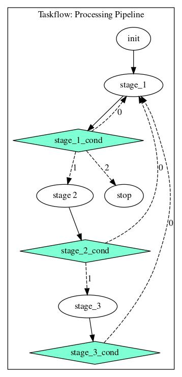

## Quickstart

Everything is a mess, just for concept illustration

1. Simple examples in `taskflow/devin_poc/control_flow_x.cpp` 
   1. Waterfall* examples build on each other.
   1. *multi_worker adds parallel iteration
   1. *multi_worker async adds ring buffers between stages, more complex data processing, and simple simulated 'remote'
   microservice.
1. Commands assume:
   1. Running from 'taskflow' base dir
   2. You have 'https://github.com/nlohmann/json' in '../json'
   3. You have 'https://github.com/cameron314/concurrentqueue' in '../concurrentqueue'

Build from taskflow directory
```
g++ -g -std=c++17 devin_poc/waterfall_control_flow_multi_worker_async.cpp -I ./ -I ../json/include -O2 -pthread -o taskflow_test
```


Check workflow and get some basic stats
```
./taskflow_test [work_units_per_sec] [runtime]
```

Composition workflow/testing

This is a work in progress, conditionals are not generalized, but adding arbitrary stages should work.

```
g++ -g -std=c++17 devin_poc/composition_testing.cpp -I ./ -I ../json/include -I ../concurrentqueue -I devin_poc/headers/ -O2 -pthread -o taskflow_test
```

```
./taskflow_test
```